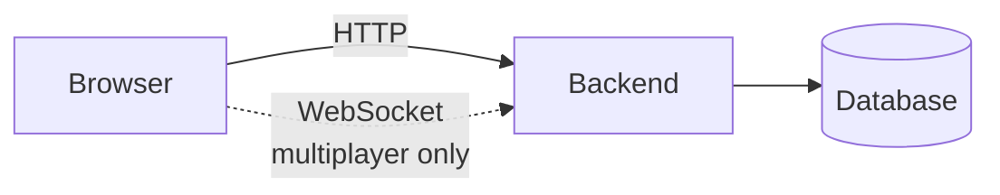

# 🚀 PSI 2026 - QuizApp

Repository with Quiz application for PSI subject in summer semester at academic year 2025/2026

## User Scenarios

Quizz App

- User can log in to app
- Users can play AZ quiz
- A leaderboard is available for authenticated users playing online
- AZ quiz

## Tech Stack

Basic diagram of our project structure

## Documentation

- This file contains introduction to the product, local setup of the project and user guide
- [docs/SPECIFICATION.md](./docs/SPECIFICATION.md) contains product description: Objectives, planned functional requirements
- [docs/DESIGN.md](./docs/DESIGN.md) contains engeneering documentation: Technical architecture, ULM diagrams, API and DB schema

## Local development

In this time project contains prototype application ([prototype/README.md](./prototype/README.md))

## Project milestones

- Milestone 1: prototype (3.3.2026): Specification, prototype & high-level design.
- Milestone 2: mvp (7.4.2026): MVP is ready, CI/CD is working (dev environment -> localhost).
- Product launch (5.5.2026): Final demo, code/test/documentation is ready, deployed to Azure (dev & prod) with NFRs met (monitoring).

## Team

- Dan Keršláger (@)
- Vlastimil Pálfi (@)
- Michal Pokorný (@)
- Jan Reisiegel (@)

## Status

- [ ] Production
  - [ ] DB
  - [ ] Frontend
  - [ ] Backend
- [ ] Monitoring
- [ ] CI/CD
- [ ] Tests
