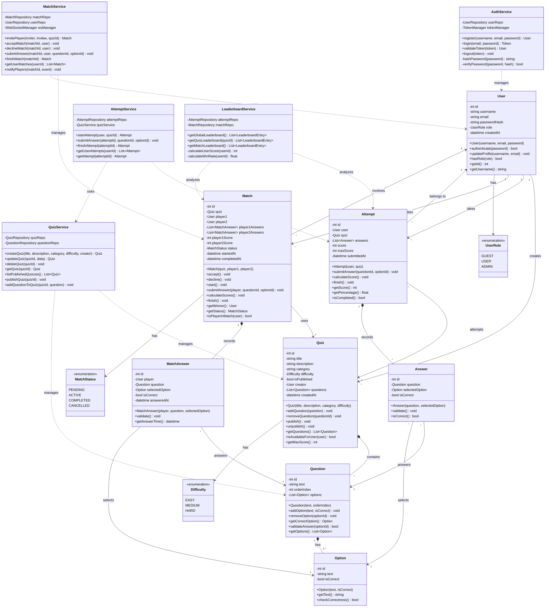

# QuizApp Class Diagram

```mermaid
classDiagram
    %% Domain Model Classes
    class User {
        -int id
        -string username
        -string email
        -string passwordHash
        -UserRole role
        -datetime createdAt
        +User(username, email, password)
        +authenticate(password) bool
        +updateProfile(username, email) void
        +hasRole(role) bool
        +getId() int
        +getUsername() string
    }

    class Quiz {
        -int id
        -string title
        -string description
        -string category
        -Difficulty difficulty
        -bool isPublished
        -User creator
        -List~Question~ questions
        -datetime createdAt
        +Quiz(title, description, category, difficulty)
        +addQuestion(question) void
        +removeQuestion(questionId) void
        +publish() void
        +unpublish() void
        +getQuestions() List~Question~
        +isAvailableForUser(user) bool
        +getMaxScore() int
    }

    class Question {
        -int id
        -string text
        -int orderIndex
        -List~Option~ options
        +Question(text, orderIndex)
        +addOption(text, isCorrect) void
        +removeOption(optionId) void
        +getCorrectOption() Option
        +validateAnswer(optionId) bool
        +getOptions() List~Option~
    }

    class Option {
        -int id
        -string text
        -bool isCorrect
        +Option(text, isCorrect)
        +getText() string
        +checkCorrectness() bool
    }

    class Attempt {
        -int id
        -User user
        -Quiz quiz
        -List~Answer~ answers
        -int score
        -int maxScore
        -datetime submittedAt
        +Attempt(user, quiz)
        +submitAnswer(questionId, optionId) void
        +calculateScore() void
        +finish() void
        +getScore() int
        +getPercentage() float
        +isCompleted() bool
    }

    class Answer {
        -int id
        -Question question
        -Option selectedOption
        -bool isCorrect
        +Answer(question, selectedOption)
        +validate() void
        +isCorrect() bool
    }

    class Match {
        -int id
        -Quiz quiz
        -User player1
        -User player2
        -List~MatchAnswer~ player1Answers
        -List~MatchAnswer~ player2Answers
        -int player1Score
        -int player2Score
        -MatchStatus status
        -datetime startedAt
        -datetime completedAt
        +Match(quiz, player1, player2)
        +accept() void
        +decline() void
        +start() void
        +submitAnswer(player, questionId, optionId) void
        +calculateScores() void
        +finish() void
        +getWinner() User
        +getStatus() MatchStatus
        +isPlayerInMatch(user) bool
    }

    class MatchAnswer {
        -int id
        -User player
        -Question question
        -Option selectedOption
        -bool isCorrect
        -datetime answeredAt
        +MatchAnswer(player, question, selectedOption)
        +validate() void
        +getAnswerTime() datetime
    }

    %% Service Classes
    class AuthService {
        -UserRepository userRepo
        -TokenManager tokenManager
        +register(username, email, password) User
        +login(email, password) Token
        +validateToken(token) User
        +logout(token) void
        -hashPassword(password) string
        -verifyPassword(password, hash) bool
    }

    class QuizService {
        -QuizRepository quizRepo
        -QuestionRepository questionRepo
        +createQuiz(title, description, category, difficulty, creator) Quiz
        +updateQuiz(quizId, data) Quiz
        +deleteQuiz(quizId) void
        +getQuiz(quizId) Quiz
        +listPublishedQuizzes() List~Quiz~
        +publishQuiz(quizId) void
        +addQuestionToQuiz(quizId, question) void
    }

    class AttemptService {
        -AttemptRepository attemptRepo
        -QuizService quizService
        +startAttempt(user, quizId) Attempt
        +submitAnswer(attemptId, questionId, optionId) void
        +finishAttempt(attemptId) Attempt
        +getUserAttempts(userId) List~Attempt~
        +getAttempt(attemptId) Attempt
    }

    class MatchService {
        -MatchRepository matchRepo
        -UserRepository userRepo
        -WebSocketManager wsManager
        +invitePlayer(inviter, invitee, quizId) Match
        +acceptMatch(matchId, user) void
        +declineMatch(matchId, user) void
        +submitAnswer(matchId, user, questionId, optionId) void
        +finishMatch(matchId) Match
        +getUserMatches(userId) List~Match~
        +notifyPlayers(matchId, event) void
    }

    class LeaderboardService {
        -AttemptRepository attemptRepo
        -MatchRepository matchRepo
        +getGlobalLeaderboard() List~LeaderboardEntry~
        +getQuizLeaderboard(quizId) List~LeaderboardEntry~
        +getMatchLeaderboard() List~LeaderboardEntry~
        -calculateUserScore(userId) int
        -calculateWinRate(userId) float
    }

    %% Enumerations
    class UserRole {
        <<enumeration>>
        GUEST
        USER
        ADMIN
    }

    class Difficulty {
        <<enumeration>>
        EASY
        MEDIUM
        HARD
    }

    class MatchStatus {
        <<enumeration>>
        PENDING
        ACTIVE
        COMPLETED
        CANCELLED
    }

    %% Relationships - Domain Model
    User "1" --> "*" Quiz : creates
    User "1" --> "*" Attempt : takes
    User "1" --> "*" Match : participates

    Quiz "1" *-- "*" Question : contains
    Question "1" *-- "2..*" Option : has

    Attempt "*" --> "1" User : belongs to
    Attempt "*" --> "1" Quiz : attempts
    Attempt "1" *-- "*" Answer : records
    Answer "*" --> "1" Question : answers
    Answer "*" --> "1" Option : selects

    Match "*" --> "1" Quiz : uses
    Match "*" --> "2" User : involves
    Match "1" *-- "*" MatchAnswer : records
    MatchAnswer "*" --> "1" Question : answers
    MatchAnswer "*" --> "1" Option : selects

    User --> UserRole : has
    Quiz --> Difficulty : has
    Match --> MatchStatus : has

    %% Relationships - Services
    AuthService ..> User : manages
    QuizService ..> Quiz : manages
    QuizService ..> Question : manages
    AttemptService ..> Attempt : manages
    AttemptService ..> QuizService : uses
    MatchService ..> Match : manages
    MatchService ..> User : uses
    LeaderboardService ..> Attempt : analyzes
    LeaderboardService ..> Match : analyzes
```
