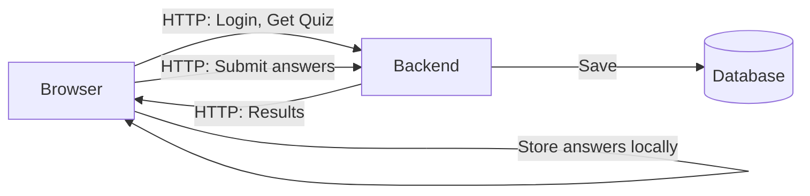
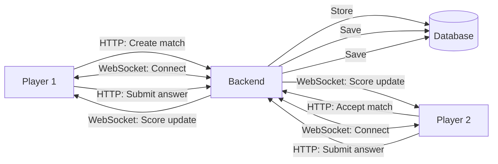
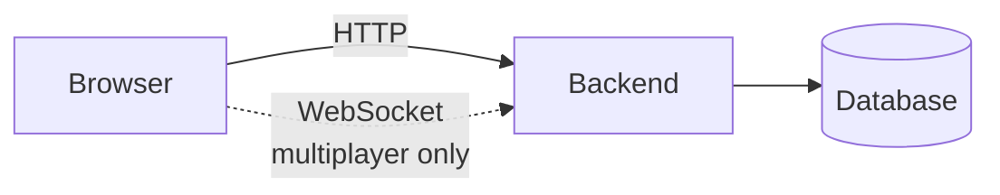

# QuizApp Component Diagram - Communication Flow

## Single-Player Mode

**Communication:** HTTP/REST only. Answers stored locally, submitted once.

---

## Multiplayer Mode

**Communication:** HTTP/REST for setup and answers. WebSocket for real-time score updates.

---

## Architecture

---

## Comparison

| Aspect            | Single-Player | Multiplayer      |
| ----------------- | ------------- | ---------------- |
| Protocol          | HTTP only     | HTTP + WebSocket |
| Answer submission | Once at end   | Per answer       |
| Real-time sync    | No            | Yes              |
