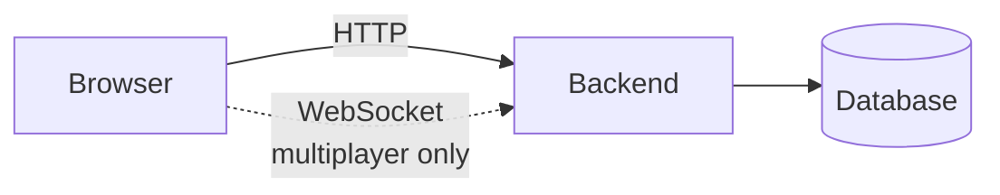
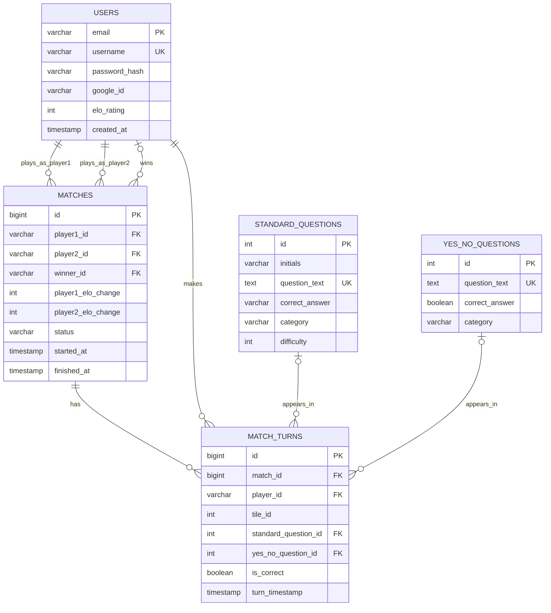
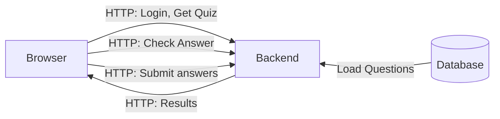
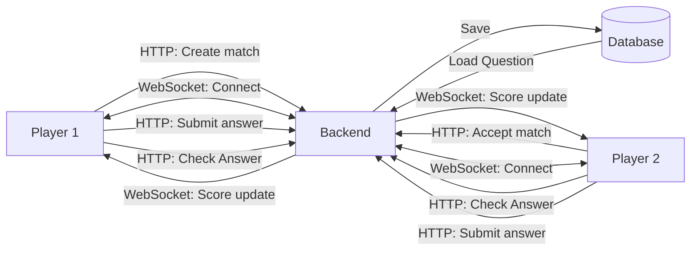
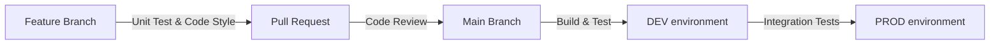

# Design documentation: QuizApp

This document presents the technical plan for implementing QuizApp project.

## Architecture



**Principles:** Stateless API with token/session auth, explicit API contracts, input validation, environment-driven config.

### Frontend

- Vite
- React, TypeScript
- HTTP client (REST API), Chakra v3

### Backend

- Python, FastAPI
- ASGI server (Uvicorn)
- python modul for PostgreSQL

### Database

- SQL relational database (PostgreSQL)

### Infrastructure

- Testing: currently using Vitest for unit tests; pytest for backend
- Deployment: Azure Cloud, GitHub Actions (CI/CD)
- Local development: Docker, Docker-compose

## Data Model



Constraint: each turn references exactly one question type (`standard_question_id` xor `yes_no_question_id`).

Original DB diagrama is in [/diagrams/DB-diagram.md](../diagrams/DB-diagram.png)

## Interaction Design

### Single-Player Mode



**Communication:** HTTP/REST only. Answers stored locally, submitted once.

### Multiplayer Mode



**Communication:** HTTP/REST for setup and answers. WebSocket for real-time score updates.

## API & Interface Specification

All endpoints are prefixed with `/api`.

### Auth

All authenticated endpoints uses `Authentication: Bearer $user_token` header. `$user_token` is generated in login endpoint, and finally sended to frontend app as a response. Frontend application must store this token for future usage.

#### Endponts:

| Method   | Path                 | Auth | Description                             |
| -------- | -------------------- | ---- | --------------------------------------- |
| `POST`   | `/users/login`       | NO   | Endpoint for login user to app          |
| `POST`   | `/users/register`    | NO   | Endpoint for register user to app       |
| `POST`   | `/users/token-renew` | YES  | Endpoint for token actualization        |
| `GET`    | `/users/info`        | YES  | Endpoint to get informations about user |
| `DELETE` | `/users/user`        | YES  | Endpoint for delete user from app       |

#### Request/Response examples

```text
// POST /users/login - request body
{ "email": "jan.novak@tul.cz", "password": "SuperSecret123" }
// 200 -> { "access_token": "<jwt>", "token_type": "bearer" }
// 401 -> { "detail": "Invalid email or password" }
// 422 -> { "detail": "Validation error" }


// POST /users/register - request body
{ "username": "jan.novak", "email": "jan.novak@tul.cz", "password": "SuperSecret123" }
// 200 -> { "access_token": "<jwt>", "token_type": "bearer" }
// 422 -> { "detail": "Validation error" }
// Note: duplicate username/email handling should ideally return 409 Conflict.


// POST /users/token-renew - no request body
// Header: Authorization: Bearer <jwt>
// 200 -> { "access_token": "<new_jwt>", "token_type": "bearer" }
// 401/403 -> invalid or missing bearer token


// GET /users/info - no request body
// Header: Authorization: Bearer <jwt>
// 200 -> { "email": "jan.novak@tul.cz", "username": "jan.novak" }
// 401/403 -> invalid or missing bearer token


// DELETE /users/user - no request body
// Header: Authorization: Bearer <jwt>
// 200 -> empty response body
// 404 -> { "error": "user_not_found", "message": "User not found." }
// 401/403 -> invalid or missing bearer token
// Idempotent: safe to call even if user was already removed.
```

### Questions

This endpoints are for the game logics.

#### Endpoints:

| Method | Path               | Auth | Description                       |
| ------ | ------------------ | ---- | --------------------------------- |
| `GET`  | `/questions`       | NO   | Endpoint for get question in game |
| `POST` | `/questions/check` | NO   | Endpoint for question evaluation  |

#### Request/Response examples

```text
// GET /questions?question_type=standard - no request body
// 200 -> {
//   "id": 12,
//   "question_type": "standard",
//   "question_text": "What is the tallest mountain on Earth?",
//   "initials": "ME",
//   "category": "Geography",
//   "difficulty": 1
// }
// 404 -> { "detail": "No questions found" }
// 422 -> { "detail": "Validation error" } // invalid question_type


// GET /questions?question_type=yes_no - no request body
// 200 -> {
//   "id": 8,
//   "question_type": "yes_no",
//   "question_text": "Is the hummingbird the smallest bird?",
//   "initials": null,
//   "category": "Nature",
//   "difficulty": null
// }


// POST /questions/check - request body (standard)
{ "question_id": 12, "answer": "Mount Everest", "question_type": "standard" }
// 200 -> { "is_correct": true, "correct_answer": "Mount Everest" }
// 404 -> { "detail": "No questions found" }
// 422 -> { "detail": "Validation error" }


// POST /questions/check - request body (yes/no)
{ "question_id": 8, "answer": true, "question_type": "yes_no" }
// 200 -> { "is_correct": true, "correct_answer": true }
// 404 -> { "detail": "No questions found" }
```

## Infrastructure & Deployment

Azure cloud environment setup, resource selection, and the CI/CD pipeline architecture

High-level plan:



## Reliability & Observability

Plan for Logging, Monitoring, Alerting, and defined SLA/SLO/SLI metrics.

## Security Architecture

Auth login flow: email stores in PostgreSQL. User presents the token and upon validation backend issues JSON Web Token back to the React app which stores it localStorage.

Additional planned security: XSRF, CORS.

## Testing Strategy

Testing is split between backend (pytest) and frontend (Vitest + Testing Library). The goal is to validate service logic, API behavior, and critical UI/API flows.

### Backend tests (pytest)

Backend tests are organized in `backend/tests`:

- `unit/`: service-level logic validation (`UserServices`, `QuestionsService`)
- `integration/`: FastAPI endpoint tests using `fastapi.testclient.TestClient`
- `db/`: currently a database testing stub with TODO plan for real PostgreSQL integration tests
- `conftest.py`: shared fixtures (test client, sample users/questions, monkeypatch-based mocks)

How backend tests work:

- Fixtures create deterministic sample data and isolate tests from external state.
- Integration tests call HTTP endpoints and assert status codes + response schema.
- Unit tests verify behavior such as authentication checks, answer validation, and token generation.
- `pytest.ini` configures discovery (`test_*.py`), async mode (`asyncio_mode=auto`), and coverage reports (`term-missing` + HTML).

Backend run commands:

```bash
cd backend
pytest
```

Useful pytest markers defined in project config: `unit`, `integration`, `db`, `slow`, `auth`.

### Frontend tests (Vitest)

Frontend tests are implemented with Vitest in a jsdom environment:

- Component tests in `frontend/app/components/__tests__/`
- API-flow tests in `frontend/app/__tests__/`
- Global setup in `frontend/vitest.setup.ts`

How frontend tests work:

- React components are tested with `@testing-library/react`.
- API requests are mocked with MSW (`msw/node`) to keep tests deterministic and independent of backend runtime.
- Test setup starts a mock server before all tests, resets handlers after each test, and closes it after test run.
- Coverage is collected with the V8 provider and exported as text, JSON, HTML, and LCOV.

Frontend run commands:

```bash
cd frontend
npm run test
npm run test:ci
```

### Current status and known gaps

- Database integration tests are not implemented yet (documented in `backend/tests/db/test_database_stub.py`).
- Current backend tests rely heavily on mocks/fixtures; this is fast for CI but should be complemented by real DB integration tests.
- Some tests still reflect older endpoint paths/payload assumptions and should be synchronized continuously with API contracts during development.
