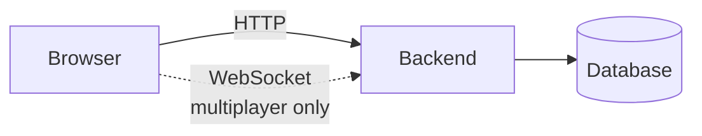
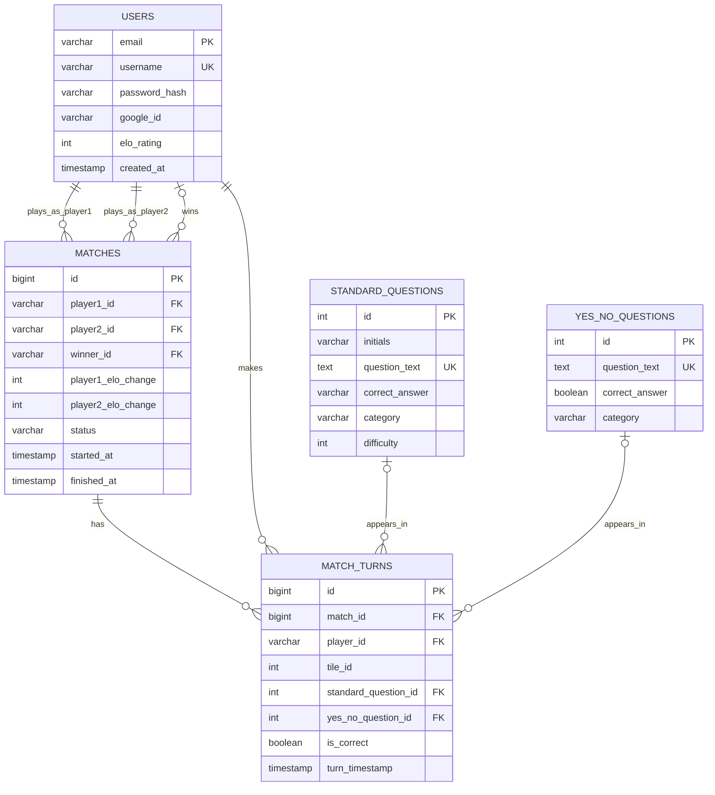
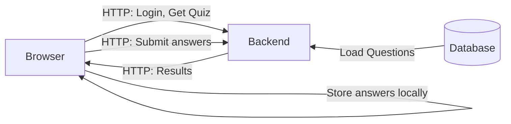
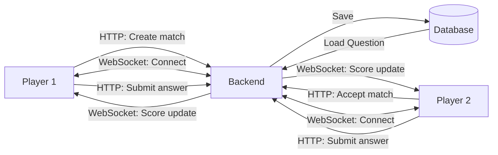
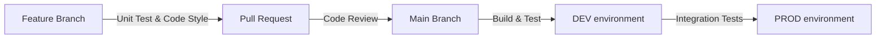

# Design documentation: QuizApp

This document presents the technical plan for implementing QuizApp project.

## Architecture

**Principles:** Stateless API with token/session auth, explicit API contracts, input validation, environment-driven config.

### Frontend

- Vite
- React, TypeScript
- HTTP client (REST API), UI framework TBD

### Backend

- Python, FastAPI
- ASGI server (Uvicorn)
- python modul for PostgreSQL

### Database

- SQL relational database (PostgreSQL)

### Infrastructure

- Testing: currently using Vitest for unit tests; pytest for backend
- Deployment: Azure Cloud, GitHub Actions (CI/CD)
- Local development: Docker, Docker-compose

## Data Model

Constraint: each turn references exactly one question type (`standard_question_id` xor `yes_no_question_id`).

Original DB diagrama is in [/diagrams/DB-diagram.md](../diagrams/DB-diagram.png)

## Interaction Design

### Single-Player Mode

**Communication:** HTTP/REST only. Answers stored locally, submitted once.

### Multiplayer Mode

**Communication:** HTTP/REST for setup and answers. WebSocket for real-time score updates.

## API & Interface Specification

TODO later

## Infrastructure & Deployment

Azure cloud environment setup, resource selection, and the CI/CD pipeline architecture

High-level plan:

TODO(@anyone) Máte jiný návrh?

## Reliability & Observability

Plan for Logging, Monitoring, Alerting, and defined SLA/SLO/SLI metrics.

## Security Architecture

Auth login flow: email stores in PostgreSQL. User presents the token and upon validation backend issues JSON Web Token back to the React app which stores it localStorage.

Additional planned security: XSRF, CORS.

## Testing Strategy

Overview of Unit, Integration, and UI testing approaches
