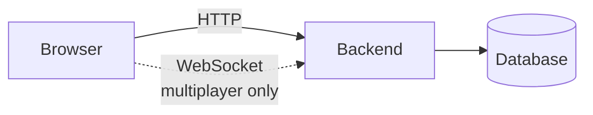
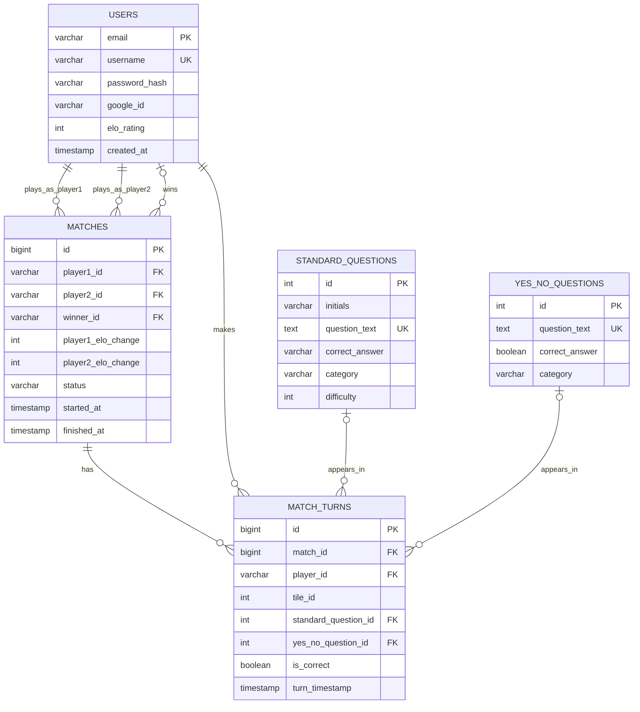
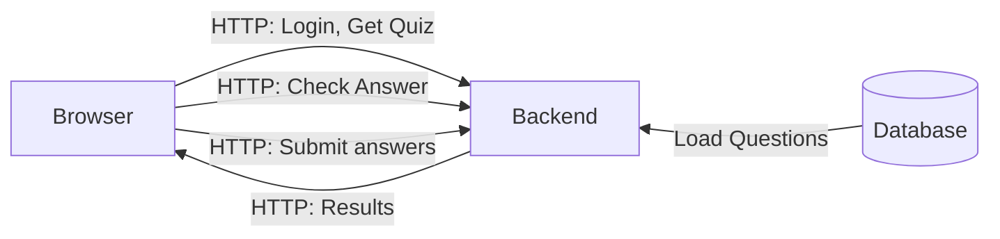
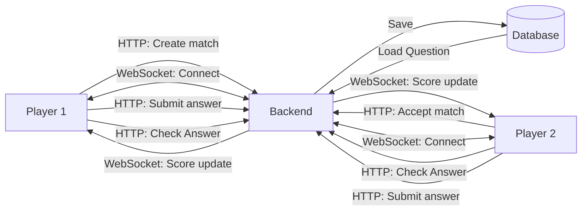
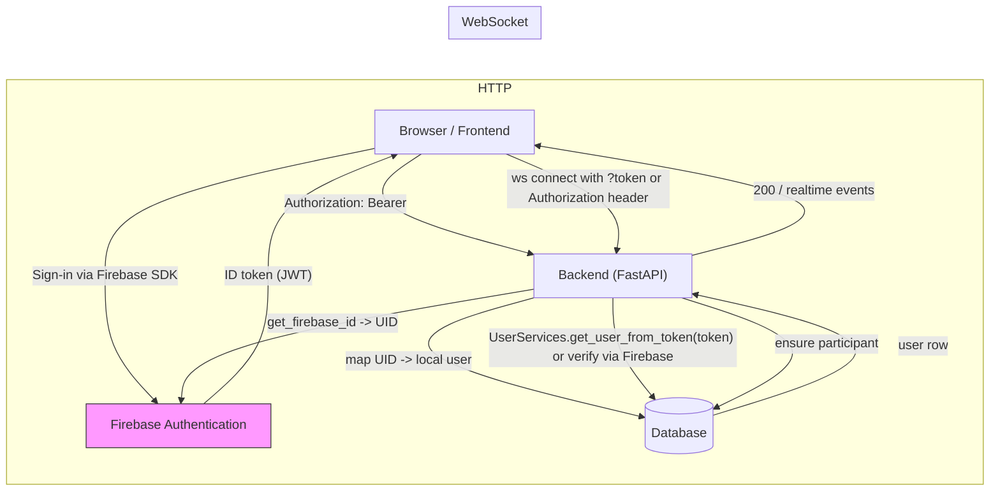
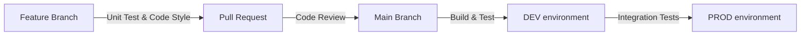
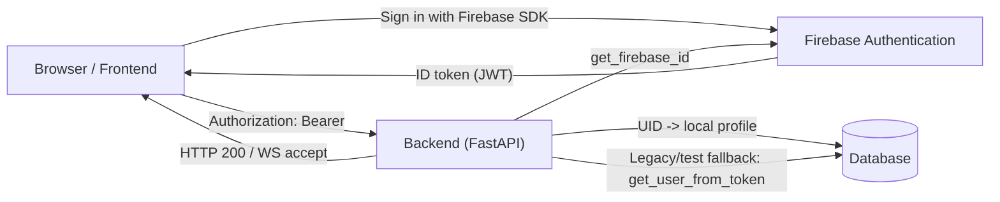

# Design documentation: QuizApp

This document presents the technical plan for implementing QuizApp project.

## Architecture



**Principles:** Stateless API with token/session auth, explicit API contracts, input validation, environment-driven config.

### Frontend

- Vite
- React, TypeScript
- HTTP client (REST API), Chakra v3

### Backend

- Python, FastAPI
- ASGI server (Uvicorn)
- python modul for PostgreSQL

### Database

- SQL relational database (PostgreSQL)

### Infrastructure

- Testing: currently using Vitest for unit tests; pytest for backend
- Deployment: Azure Cloud, GitHub Actions (CI/CD)
- Local development: Docker, Docker-compose

## Data Model



Constraint: each turn references exactly one question type (`standard_question_id` xor `yes_no_question_id`).

Original DB diagrama is in [/diagrams/DB-diagram.md](../diagrams/DB-diagram.png)

## Interaction Design

### Single-Player Mode



**Communication:** HTTP/REST only. Answers stored locally, submitted once.

### Multiplayer Mode



**Communication:** HTTP/REST for setup and answers. WebSocket for real-time score updates.

## API & Interface Specification

All endpoints are prefixed with `/api`.

### API & Auth (exact backend mechanics)

All backend endpoints are prefixed with `/api`. The backend uses Firebase Authentication for identity; HTTP endpoints validate an incoming Firebase ID token via the `get_firebase_id` dependency and map the verified UID to a local user record.

Key backend mechanics:

- HTTP authentication: clients must include `Authorization: Bearer <firebase_id_token>` for protected endpoints. The FastAPI dependency `get_firebase_id` extracts and verifies the token, returning the Firebase UID.
- Local user mapping: after verification the backend looks up the user in the local DB (via `UserServices.get_user(uid)`) and will create a local user record when requested by endpoints like `/api/users/register` or lazily on first use.
- WebSocket authentication: the multiplayer WebSocket (`/api/multiplayer/ws/{match_id}`) accepts a token either via `?token=<token>` query parameter or an `Authorization: Bearer <token>` header. For WebSocket connections the code may use `UserServices.get_user_from_token(token)` (legacy token support) to resolve a user row.

User-related endpoints (as implemented in `backend/routers/Users.py`):

- `POST /api/users/register` — Registers a Firebase-authenticated user in the local DB. Requires a `username` parameter and the Firebase token (via `get_firebase_id`). Returns `201` on success.
- `POST /api/users/login` — Login endpoint that accepts `username` plus Firebase token (via `get_firebase_id`). If the local user does not exist it will be created. Returns `200`.
- `GET /api/users/info` — Returns the authenticated user's `uid`, `username`, and `elo_rating`. Requires Firebase token.
- `GET /api/users/leaderboard?limit=30` — Returns the top users ranked by Elo. Public read; implemented in backend and returns `leaderboard` array.

Questions endpoints (as implemented in `backend/routers/questions.py`):

- `GET /api/questions?question_type=standard|yes_no` — Returns a single random question filtered by `question_type`. Public.
- `POST /api/questions/check` — Accepts `question_id`, `answer`, and `question_type` and returns `{ is_correct, correct_answer }`. Public.

Multiplayer endpoints and WebSocket (as implemented in `backend/routers/multiplayer.py`):

- `POST /api/multiplayer/queue/join` — Body: `QueueJoinRequest` (includes `game_mode`); requires authenticated user (internal helper `_get_authenticated_user` uses `get_firebase_id` and local DB lookup). Returns queued status or matched opponent info.
- `POST /api/multiplayer/queue/leave` — Leaves matchmaking queue for the authenticated user.
- `GET /api/multiplayer/queue/status` — Returns queue status and, if already matched, the active match id.
- `GET /api/multiplayer/matches/{match_id}` — Returns match state for a given `match_id`; requires participant authentication.
- `POST /api/multiplayer/matches/{match_id}/turn` — Submit a turn; body: `SubmitTurnRequest` (tile_id, question_type, question_id, is_correct, optional game_state). Broadcasts score updates via realtime service.
- `POST /api/multiplayer/matches/{match_id}/forfeit` — Forfeit an ongoing match; clears snapshots and broadcasts match finish.
- `WebSocket /api/multiplayer/ws/{match_id}` — Real-time channel. Client must provide a token via `?token=` or `Authorization` header. Server verifies the token (supports legacy token lookup via `UserServices.get_user_from_token`) and then connects the player to realtime service. The socket accepts messages (`ping`, `state_request`, `game_snapshot`, `timer_update`) and broadcasts `player_connected`, `player_disconnected`, `score_updated`, `game_snapshot`, `match_snapshot`, `match_finished`, etc.

Authentication notes — exact mechanics

- HTTP endpoints use `get_firebase_id` (FastAPI dependency) to extract and validate Firebase ID tokens. The dependency returns the Firebase `uid` that service layers use to map to local users.
- In multiplayer routes a higher-level helper `_get_authenticated_user` attempts a DB lookup for the UID, but falls back to an in-memory cache (`deps._user_token_cache`) when the DB is unavailable or the user is not yet persisted.
- WebSocket connections support legacy token-based lookup via `UserServices.get_user_from_token(token)`; this is used for compatibility with older clients or non-Firebase tokens.

Examples

1. Typical authenticated HTTP request (protected endpoint):

Header: `Authorization: Bearer <firebase_id_token>`

2. WebSocket connection (preferred):

ws://<host>/api/multiplayer/ws/123?token=<firebase_id_token>

Or with header during handshake:

Authorization: Bearer <firebase_id_token>

If the token is missing or invalid the WebSocket is closed with code `1008`.

Authentication & WebSocket flowchart (backend specifics)



### Questions API

The questions router is implemented in `backend/routers/questions.py` and is fully public.

#### Endpoints

| Method | Path                   | Auth | Description                            |
| ------ | ---------------------- | ---- | -------------------------------------- |
| `GET`  | `/api/questions`       | NO   | Returns one random question.           |
| `POST` | `/api/questions/check` | NO   | Validates an answer for a question id. |

#### GET `/api/questions`

Query parameter:

- `question_type`: `standard` or `yes_no`, default `standard`

Response model: `GetQuestionResponse`

| Field           | Type                   | Notes                          |
| --------------- | ---------------------- | ------------------------------ |
| `id`            | `int`                  | Question id                    |
| `question_type` | `standard` or `yes_no` | Selected question type         |
| `question_text` | `string`               | The question text              |
| `initials`      | `string` or `null`     | Present for standard questions |
| `category`      | `string` or `null`     | Category label                 |
| `difficulty`    | `int` or `null`        | Present for standard questions |

Behavior:

- Returns `404` with `{ "detail": "No questions found" }` if no question exists for the requested type.
- FastAPI returns `422` for invalid `question_type` values.

Example responses:

```text
GET /api/questions?question_type=standard
200 -> {
    "id": 12,
    "question_type": "standard",
    "question_text": "What is the tallest mountain on Earth?",
    "initials": "ME",
    "category": "Geography",
    "difficulty": 1
}

GET /api/questions?question_type=yes_no
200 -> {
    "id": 8,
    "question_type": "yes_no",
    "question_text": "Is the hummingbird the smallest bird?",
    "initials": null,
    "category": "Nature",
    "difficulty": null
}
```

#### POST `/api/questions/check`

Request model: `CheckQuestionRequest`

| Field           | Type                             | Notes                                                 |
| --------------- | -------------------------------- | ----------------------------------------------------- |
| `question_id`   | `int`                            | Required                                              |
| `answer`        | `string` or `bool`               | Standard questions use `string`, yes/no use `bool`    |
| `question_type` | `standard` or `yes_no` or `null` | Optional; defaults to `standard` in the service layer |

Response model: `CheckQuestionResponse`

| Field            | Type               | Notes                                   |
| ---------------- | ------------------ | --------------------------------------- |
| `is_correct`     | `bool`             | Whether the answer matches              |
| `correct_answer` | `string` or `bool` | Expected answer returned by the service |

Behavior:

- Returns `404` with `{ "detail": "No questions found" }` if the question cannot be resolved.
- FastAPI returns `422` for invalid payloads.

Example requests:

```text
POST /api/questions/check
{ "question_id": 12, "answer": "Mount Everest", "question_type": "standard" }
200 -> { "is_correct": true, "correct_answer": "Mount Everest" }

POST /api/questions/check
{ "question_id": 8, "answer": true, "question_type": "yes_no" }
200 -> { "is_correct": true, "correct_answer": true }
```

### Multiplayer API

The multiplayer router is implemented in `backend/routers/multiplayer.py`. HTTP endpoints require authenticated Firebase users via `get_firebase_id`; the WebSocket endpoint accepts a token in the query string or Authorization header.

#### Endpoints

| Method      | Path                                          | Auth | Description                                       |
| ----------- | --------------------------------------------- | ---- | ------------------------------------------------- |
| `POST`      | `/api/multiplayer/queue/join`                 | YES  | Join matchmaking or get matched immediately.      |
| `POST`      | `/api/multiplayer/queue/leave`                | YES  | Leave the matchmaking queue.                      |
| `GET`       | `/api/multiplayer/queue/status`               | YES  | Get queue status and active match info.           |
| `GET`       | `/api/multiplayer/matches/{match_id}`         | YES  | Fetch current match state.                        |
| `POST`      | `/api/multiplayer/matches/{match_id}/turn`    | YES  | Submit a turn result and broadcast score updates. |
| `POST`      | `/api/multiplayer/matches/{match_id}/forfeit` | YES  | Forfeit the match.                                |
| `WebSocket` | `/api/multiplayer/ws/{match_id}`              | YES  | Real-time game connection.                        |

#### Queue join

Request model: `QueueJoinRequest`

| Field       | Type     | Notes             |
| ----------- | -------- | ----------------- |
| `game_mode` | `string` | Default `pyramid` |

Response model: `QueueJoinResponse`

| Field               | Type                  | Notes                     |
| ------------------- | --------------------- | ------------------------- |
| `status`            | `queued` or `matched` | Current matchmaking state |
| `queue_position`    | `int` or `null`       | Present when queued       |
| `matched_match_id`  | `int` or `null`       | Present when matched      |
| `opponent_uid`      | `string` or `null`    | Present when matched      |
| `opponent_username` | `string` or `null`    | Present when matched      |
| `elo_window`        | `int`                 | Matchmaking window size   |

#### Queue status

Response model: `QueueStatusResponse`

| Field              | Type            | Notes                                |
| ------------------ | --------------- | ------------------------------------ |
| `in_queue`         | `bool`          | Whether the user is currently queued |
| `queue_position`   | `int` or `null` | Queue position when queued           |
| `waited_seconds`   | `int`           | Seconds spent waiting                |
| `elo_window`       | `int` or `null` | Active Elo search window             |
| `matched_match_id` | `int` or `null` | Set when a match already exists      |

#### Match state

Response model: `MatchStateResponse`

| Field                             | Type                                 | Notes                       |
| --------------------------------- | ------------------------------------ | --------------------------- |
| `id`                              | `int`                                | Match id                    |
| `status`                          | `ongoing`, `completed`, or `aborted` | Match status                |
| `player1` / `player2`             | `MatchParticipant`                   | Player metadata             |
| `winner_uid`                      | `string` or `null`                   | Winner UID when match ended |
| `player1_score` / `player2_score` | `int`                                | Current score               |
| `started_at` / `finished_at`      | `datetime` or `null`                 | Timestamps                  |

#### Turn submission

Request model: `SubmitTurnRequest`

| Field           | Type                   | Notes                                |
| --------------- | ---------------------- | ------------------------------------ |
| `tile_id`       | `int`                  | Must be greater than 0               |
| `question_type` | `standard` or `yes_no` | Required                             |
| `question_id`   | `int`                  | Must be greater than 0               |
| `is_correct`    | `bool`                 | Evaluated result                     |
| `game_state`    | `dict` or `null`       | Optional snapshot broadcast to peers |

Response model: `SubmitTurnResponse`

| Field           | Type                   |
| --------------- | ---------------------- |
| `match_id`      | `int`                  |
| `tile_id`       | `int`                  |
| `question_type` | `standard` or `yes_no` |
| `question_id`   | `int`                  |
| `is_correct`    | `bool`                 |
| `player1_score` | `int`                  |
| `player2_score` | `int`                  |

#### Forfeit

Response model: `ForfeitResponse`

| Field        | Type                                 | Notes                      |
| ------------ | ------------------------------------ | -------------------------- |
| `match_id`   | `int`                                | Match id                   |
| `status`     | `ongoing`, `completed`, or `aborted` | Final status               |
| `winner_uid` | `string`                             | Winner UID after forfeit   |
| `reason`     | `string`                             | The backend uses `forfeit` |

#### WebSocket behavior

Connection rules:

- Token can be passed as `?token=<token>` or `Authorization: Bearer <token>`.
- If the token is missing or invalid the server closes the socket with code `1008`.
- The server resolves the user through `UserServices.get_user_from_token(token)` and verifies the user is a participant in the match.

Inbound messages:

- `ping` -> server replies with `pong` and the match id.
- `state_request` -> server sends `match_snapshot` and, if available, `game_snapshot`.
- `game_snapshot` -> server stores and rebroadcasts the snapshot.
- `timer_update` -> server rebroadcasts only if the sender matches the current turn owner.

Outbound events:

- `match_snapshot`
- `game_snapshot`
- `player_connected`
- `player_disconnected`
- `score_updated`
- `match_finished`
- `error`

Example connection:

```text
ws://<host>/api/multiplayer/ws/123?token=<firebase_id_token>
```

## Infrastructure & Deployment

Azure cloud environment setup, resource selection, and the CI/CD pipeline architecture

High-level plan:



## Reliability & Observability

Plan for Logging, Monitoring, Alerting, and defined SLA/SLO/SLI metrics.

Backend logging is centralized in `backend/logging_config.py` and keeps the existing structured JSON stdout output for container logs. When the Azure Container App exposes `APPLICATIONINSIGHTS_CONNECTION_STRING`, the backend also initializes Azure Monitor OpenTelemetry so the same Python logs are exported to Application Insights.

Request IDs and request metadata are attached to each log record to make traces and failures easier to correlate in Azure.

## Security Architecture

Authentication is Firebase-based. The frontend signs users in with Firebase Authentication and stores the resulting Firebase ID token on the client. Protected HTTP requests send that token in `Authorization: Bearer <firebase_id_token>`.

Backend verification flow:

- `get_firebase_id` verifies the Firebase ID token with the Firebase Admin SDK.
- If Firebase Admin is not configured, the dependency falls back to `UserServices.get_user_from_token`, which is used by tests and legacy token flows.
- After verification, the backend maps the Firebase UID to the local user table and uses local records for app-specific data such as username and Elo rating.
- Multiplayer WebSocket connections accept the token either in the query string or in the `Authorization` header and reject missing or invalid tokens with close code `1008`.

Security properties:

- No application password is stored or issued by the backend.
- Firebase is the source of identity; the backend is the source of authorization and local profile state.
- Firebase configuration is driven by environment variables and initialized only when the service-account fields are present.

Additional planned security: XSRF, CORS, token revocation handling, and optional rate limiting.



## Testing Strategy

Testing is split between backend (pytest) and frontend (Vitest + Testing Library). The goal is to validate service logic, API behavior, and critical UI/API flows.

### Backend tests (pytest)

Backend tests are organized in `backend/tests`:

- `unit/`: service-level logic validation (`UserServices`, `QuestionsService`)
- `integration/`: FastAPI endpoint tests using `fastapi.testclient.TestClient`
- `db/`: currently a database testing stub with TODO plan for real PostgreSQL integration tests
- `conftest.py`: shared fixtures (test client, sample users/questions, monkeypatch-based mocks)

How backend tests work:

- Fixtures create deterministic sample data and isolate tests from external state.
- Integration tests call HTTP endpoints and assert status codes + response schema.
- Unit tests verify behavior such as authentication checks, answer validation, and token generation.
- `pytest.ini` configures discovery (`test_*.py`), async mode (`asyncio_mode=auto`), and coverage reports (`term-missing` + HTML).

Backend run commands:

```bash
cd backend
pytest
```

Useful pytest markers defined in project config: `unit`, `integration`, `db`, `slow`, `auth`.

### Frontend tests (Vitest)

Frontend tests are implemented with Vitest in a jsdom environment:

- Component tests in `frontend/app/components/__tests__/`
- API-flow tests in `frontend/app/__tests__/`
- Global setup in `frontend/vitest.setup.ts`

How frontend tests work:

- React components are tested with `@testing-library/react`.
- API requests are mocked with MSW (`msw/node`) to keep tests deterministic and independent of backend runtime.
- Test setup starts a mock server before all tests, resets handlers after each test, and closes it after test run.
- Coverage is collected with the V8 provider and exported as text, JSON, HTML, and LCOV.

Frontend run commands:

```bash
cd frontend
npm run test
npm run test:ci
```

### Current status and known gaps

- Database integration tests are not implemented yet (documented in `backend/tests/db/test_database_stub.py`).
- Current backend tests rely heavily on mocks/fixtures; this is fast for CI but should be complemented by real DB integration tests.
- Some tests still reflect older endpoint paths/payload assumptions and should be synchronized continuously with API contracts during development.
