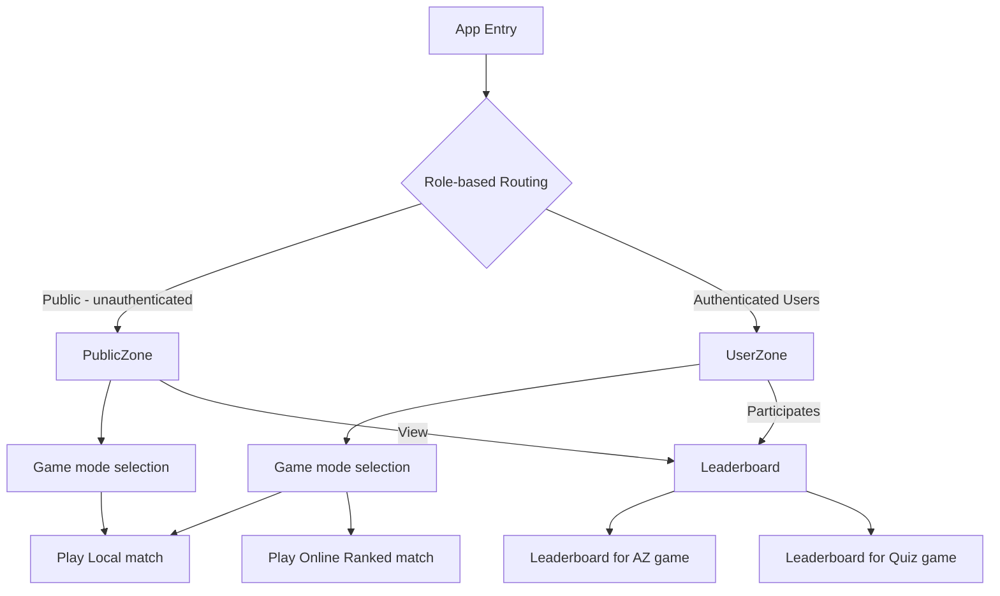

# Production Specification: QuizApp

A competitive, real-time quiz platform where users test knowledge individually or challenge friends to head-to-head matches across devices. Semestral project for PSI and RDB (Summer 2026).

## Product Vision & Target Audience

**Core Capabilities:**

- Individual quiz mode with instant feedback and scoring
- Real-time two-player competitive matches with live score synchronization
- Global and quiz-specific leaderboards
- Secure user accounts and admin quiz management
- Cross-browser support (desktop, tablet, mobile)
- Containerized architecture deployable to Azure or AWS

**Tech Stack:** React + TypeScript (frontend) | FastAPI + Python (backend) | SQL database | Docker

**Architecture:** Stateless REST + WebSocket backend with persistent SQL storage, responsive React SPA.

## User Roles

- **Guest**: Browse public pages; register/login to play ranked matches, without login can play local AZ game
- **User**: Take quizzes, challenge others, view results and leaderboards, receive real-time match notifications

## UX Flow

## Prototype

Working prototype of this application is available at: [Google AU Studio Build](https://ai.studio/apps/8f6644ec-ae49-499b-b083-a20b614060b6) (temporarily hosted on Google AI Studio, the final application will be hosted in Azure - inline with the NFRs below).

## Functional Requirements

### Must have

- AZ quiz game mode: Local game mode, Ranked multiplayer
- User Authentification (username - email, password)
- Laptop, Mobile, Web application
- Dark/Light mode

### Should have

- Basic QuizGame: Ranked and unranked
- Third-party authentification: Google Oauth: Microsoft OAuth, ...
- User Profiles: Informations about users, leadeboard, game history

### Could have

- Hexagonal AZ game mode: Online Ranked and local unranked multiplayer modes
- Watching other games

## Non-Goals

- Match replaying

## Non-Functional Requirements

- Availability & Reliability: The system must be hosted on Azure with a target availability of 99.5% (SLA), particularly during the final submission and exam periods.
  - Health checks must be implemented to facilitate automated instance recovery within the cloud environment.
- Scalability: To handle traffic spikes near project deadlines, the application shall utilize Azure Auto-scaling and capacity planning.
- Security: The platform must implement CSRF/XSRF protection and enforce a strict CORS policy configuration. User authentication will use OTP and secure credential management.
- Observability (Monitoring & Logging): Real-time monitoring, alerting, and logging must be configured using Azure Application Insights to track system health and errors.
- CI/CD Pipeline: A fully automated CI/CD pipeline must be established to execute unit and integration tests on every commit to the main branch. Successful builds must be automatically deployed to the Azure environment (guarded by quality checks, unit and integration tests).
- Code Quality & Maintainability: The project must adhere to "Clean Code" principles.
  - All architectural decisions and changes must be documented in the repository via Markdown files (README, Spec, and Design Doc).
  - All code must have consistent code style.
  - No direct commits to the main (all changes are made via Pull Requests with Code Review).
  - Unit tests with $\ge$ 80% coverage.
